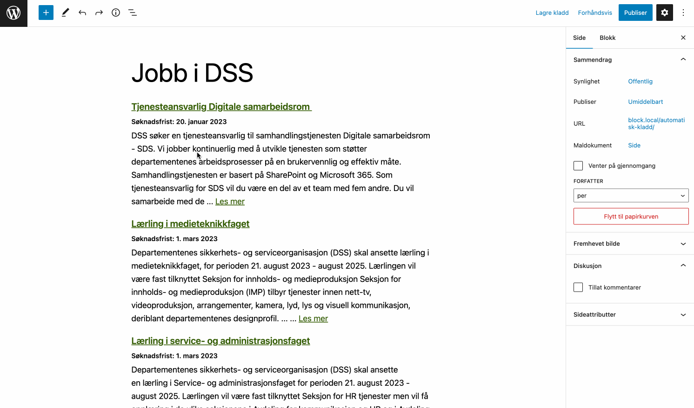
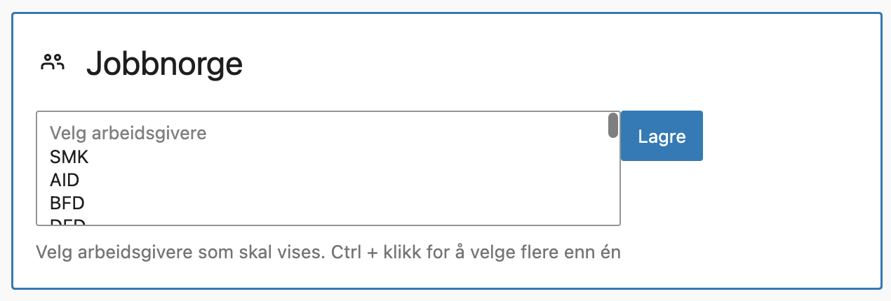
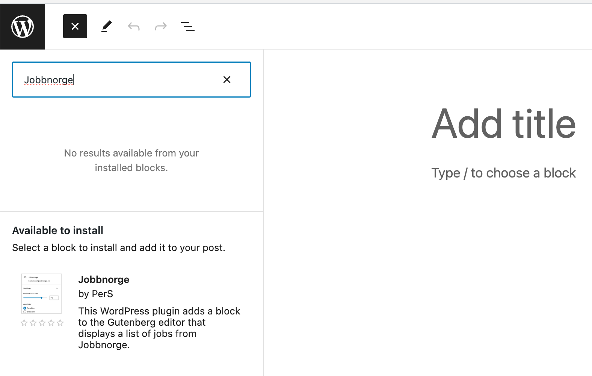
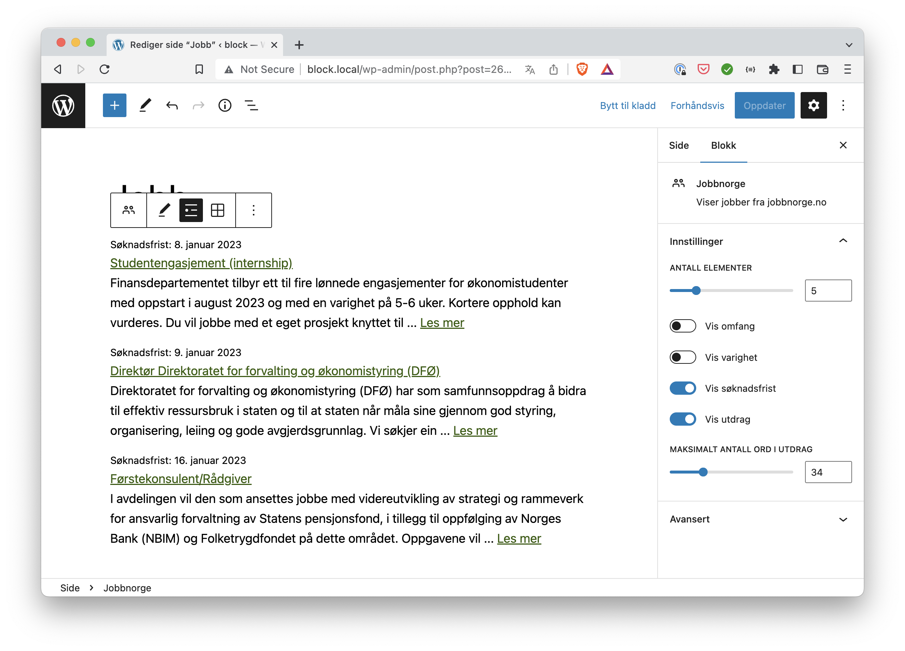
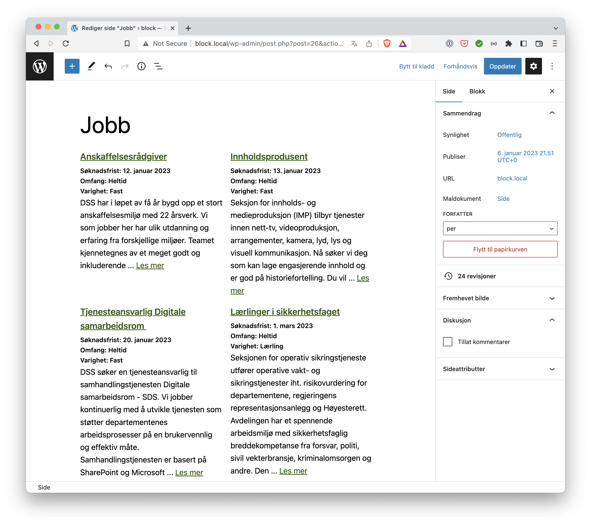
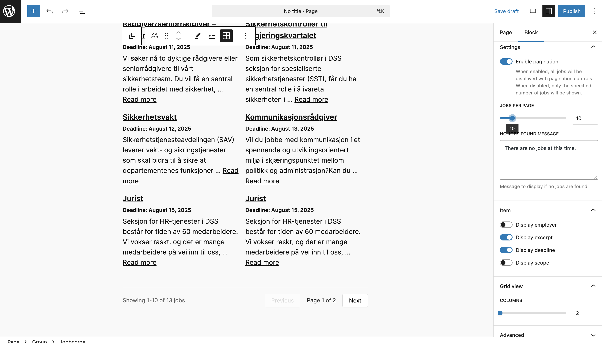

# Jobbnorge Block

> **NOTE**: Breaking change in 2.0.0: The Public Jobbnorge API is used, and you will have to use and add the employerID. You get the employerID from your Jobbnorge contact.  The old block is still available in the 1.0 branch and releases.

> Also available at https://wordpress.org/plugins/jobbnorge-block/

This WordPress plugin adds a block to the Gutenberg editor that displays a list of jobs from Jobbnorge.

See: [Features](#features) | [Installation](#installation) | [Use](#use) | [Filters](#filters) | [Styling](#styling) | [License](#license) | [Changelog](CHANGELOG.md)




## Featueres

In 2.0 the new Jobbnorge API is used, and the following features are available ( ~~strikethrough~~ means removed, since it's not in the new API):

-   Sort jobs bye deadline, closest first.
-   Does not show jobs that are past the deadline.
-   Set the number of jobs to display.
-   ~~Set the number of words in the excerpt.~~
-   Set the no jobs message.
-   Show or hide the job excerpt.
-   Show or hide the job deadline.
-   Show or hide the job scope.
-   ~Show or hide the job duration.~
-   Display the jobs in a grid or list view.
-   Set the number of columns in the grid view.

**New features in 2.0**:
- Add more than one employer.
- If more than one employer is added, order jobs by employer or deadline.
- Define which employers are available in the block, using the `jobbnorge_employers` filter:

	```php
	add_filter( 'jobbnorge_employers', function( $employers ) {
		$employers = [
			[
				'label'    => 'Select employer',
				'value'    => '',
				'disabled' => true, // Optional.
			],
			[
				'label' => 'Employer 1',
				'value' => '1234',
			],
			[
				'label' => 'Employer 2',
				'value' => '5678',
			],
		];
		return $employers;
	} );
	```
	
	
	* Ctrl-click (Windows) or Cmd-click (Mac) to select multiple employers.
	* Alt-click (Windows) or Option-click (Mac) to select a range of employers.

## Installation

Either, add the block from the Block Directory:

1. To add a block from the Block Directory, navigate to the post editor. 
1. Place your cursor where you would like a new block option. 
1. Select the “Add Block” button in the top-left area of the editor screen. 
1. Search for “Jobbnorge” and select the “Jobbnorge" block:

	

Or, add the block from the WordPress admin:
1. In the WordPress admin, go to the "Plugins" screen, click "Add New" and search for "Jobbnorge".
1. Click "Install Now" and then "Activate Plugin".
1. Use the Gutenberg editor to add the block to a page or post.

## Use

You'll find the block in the "widget" category, look for "Jobbnorge".

### 1) Add the employerID to Jobbnorge.

> You get the employerID from your Jobbnorge contact.

Separate multiple employerIDs with a comma, or add employers using the [`jobbnorge_employers`](#filters) filter.

[](.wordpress-org/screenshot-2.png)


### 2) Modify the block settings.

-   Set the number of jobs to display.
-   Set the no jobs message.
-   Show or hide the employer name.
-   Show or hide the job excerpt.
-   Show or hide the job deadline.
-   Show or hide the job scope.

If you've added more than one employer, you can order jobbs by employer or deadline.

[](.wordpress-org/screenshot-3.png)

### 3 optional), Grid view.

-   Set the number of columns in the grid view.

[](.wordpress-org/screenshot-4.png)


## Filters

### `jobbnorge_employers`

The `jobbnorge_employers` filter can be used to define which employers are available in the block: 

```php
add_filter( 'jobbnorge_employers', function( $employers ) {
	$employers = [
		[
			'label'    => 'Select employer',
			'value'    => '',
			'disabled' => true, // Optional.
		],
		[
			'label' => 'Employer 1',
			'value' => '1234',
		],
		[
			'label' => 'Employer 2',
			'value' => '5678',
		],
	];
	return $employers;
} );
```

### `jobbnorge_cache_path`

The `jobbnorge_cache_path` filter can be used to define the cache path. Default is `WP_CONTENT_DIR . '/cache/jobbnorge'`.

```php
add_filter( 'jobbnorge_cache_path', function( $path ) {
	$path = WP_CONTENT_DIR . '/cache/jobbnorge';
	return $path;
} );
```

### `jobbnorge_cache_time`

The `jobbnorge_cache_time` filter can be used to define the cache time. Default is `30 * MINUTE_IN_SECONDS`.

```php
add_filter( 'jobbnorge_cache_time', function( $time ) {
	$time = 30 * MINUTE_IN_SECONDS;
	return $time;
} );
```

## Styling

The block html look like this, and uses the following classes for styling:

```html
<ul class="has-employer has-dates has-scope has-excerpts wp-block-dss-jobbnorge">
	<li class="wp-block-dss-jobbnorge__item">
		<div class="wp-block-dss-jobbnorge__item-title"><a
				href="https://www.jobbnorge.no/ledige-stillinger/stilling/XXXXXX">Title</a></div>
		<div class="wp-block-dss-jobbnorge__item-meta">
			<div class="wp-block-dss-jobbnorge__item-employer">Employer</div>
			<time datetime="2023-11-26T00:00:00+00:00" class="wp-block-dss-jobbnorge__item-deadline">Deadline:
				1/1/1970</time>
			<div class="wp-block-dss-jobbnorge__item-scope">Scope: Full time</div>
		</div>
		<div class="wp-block-dss-jobbnorge__item-excerpt">The excerpt … <a
				href="https://www.jobbnorge.no/ledige-stillinger/stilling/XXXXXX">Read more</a>
		</div>
	</li>
	.
	.
	.
</ul>
```

`is-grid`, `columns-N` (N = 2-6), `has-employer`, `has-excerpts`, `has-deadline` and `has-scope` are added to the `<ul>` element depending on the block settings.

Default styling is provided by the [`style.scss`](src/style.scss) file.


## Copyright and license

The Jobbnorge Block is copyright 2023 Per Søderlind

The Jobbnorge Block is free software: you can redistribute it and/or modify it under the terms of the GNU General Public License as published by the Free Software Foundation, either version 2 of the License, or (at your option) any later version.

The Jobbnorge Block is distributed in the hope that it will be useful, but WITHOUT ANY WARRANTY; without even the implied warranty of MERCHANTABILITY or FITNESS FOR A PARTICULAR PURPOSE. See the GNU General Public License for more details.

You should have received a copy of the GNU Lesser General Public License along with the Extension. If not, see http://www.gnu.org/licenses/.
