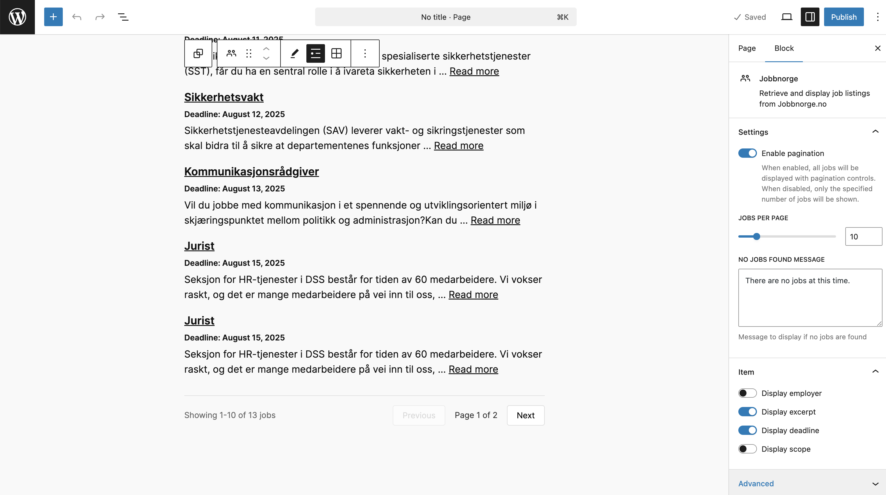

# WordPress Jobbnorge Block

This is a WordPress plugin that adds a block to the Gutenberg editor that displays a list of jobs from Jobbnorge.

## Use

### Add the Jobbnorge URL.

### Modify the block settings.

### Grid view.

## Installation

1. Clone the repository into the `wp-content/plugins` directory
1. Activate the plugin through the 'Plugins' screen in WordPress
1. Use the Gutenberg editor to add the block to a page or post.

## Credits

-   The Jobbnorge Block is an extension of the [Gutenberg core/rss block](https://github.com/WordPress/gutenberg/tree/trunk/packages/block-library/src/rss)

## Copyright and license

WordPress Jobbnorge Block is copyright 2023 Per Søderlind

WordPress Jobbnorge Block is free software: you can redistribute it and/or modify it under the terms of the GNU General Public License as published by the Free Software Foundation, either version 2 of the License, or (at your option) any later version.

WordPress Jobbnorge Block is distributed in the hope that it will be useful, but WITHOUT ANY WARRANTY; without even the implied warranty of MERCHANTABILITY or FITNESS FOR A PARTICULAR PURPOSE. See the GNU General Public License for more details.

You should have received a copy of the GNU Lesser General Public License along with the Extension. If not, see http://www.gnu.org/licenses/.
